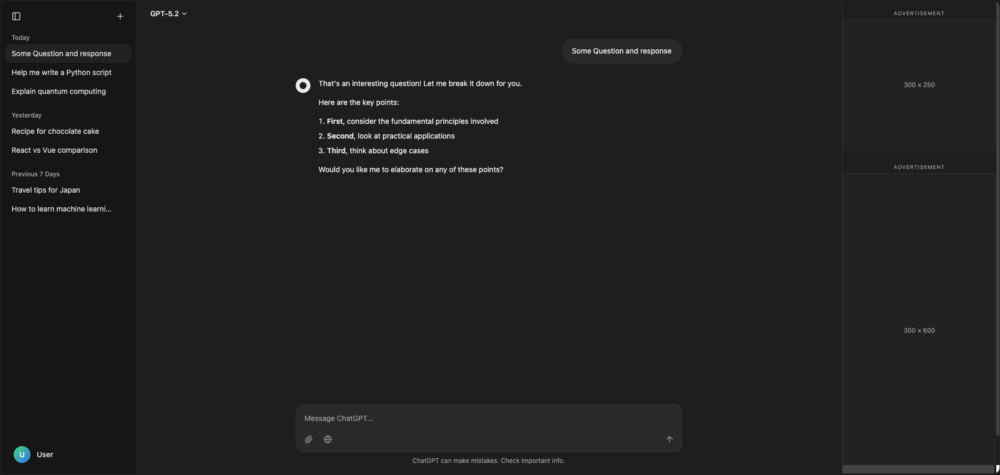
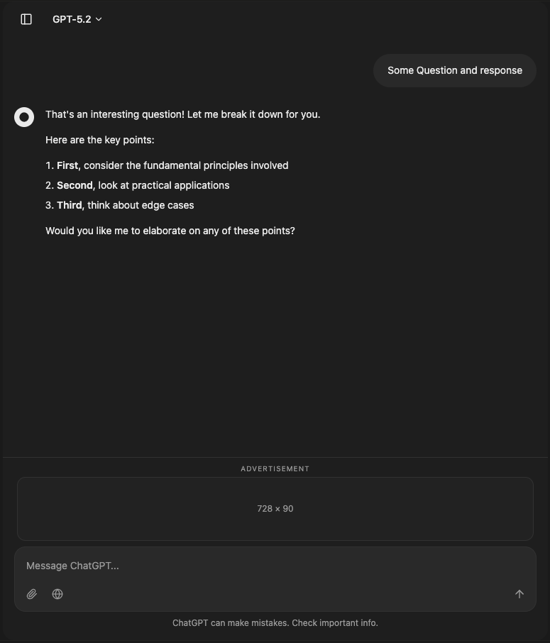
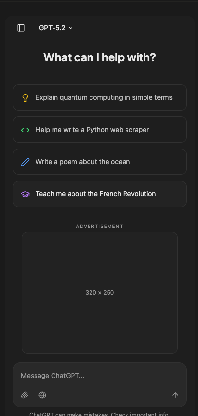

# ChatGPT UI Clone — Responsive with Ad Monetization

<h2 align="center">Desktop</h2>
<p align="center">
  
</p>

<h2 align="center">Tablet & Mobile</h2>
<p align="center">
  
  &nbsp;&nbsp;
  
</p>

A pixel-perfect ChatGPT interface clone built with **React**, **TypeScript**, **Tailwind CSS**, and **Vite**. Features a fully responsive layout optimized for three device tiers with strategically placed IAB-standard ad slots.

---

## 🖥️ Device Layouts & Size Ratios

### Desktop (1024px+)

| Section | Width | Ratio |
|---------|-------|-------|
| Left Sidebar | 256px | ~18% |
| Chat Area | flexible (~884px on 1440px screen) | ~61% |
| Right Ad Sidebar | 300px | ~21% |

- **Left sidebar** pushes the content area (toggle open/close)
- **Right ad sidebar** is always visible with two IAB-standard slots:
  - `300×250` Medium Rectangle
  - `300×600` Half Page
- **No inline ads** — the sidebar handles all monetization
- Chat content is capped at `768px` max-width for optimal readability

### Tablet (768px – 1023px)

| Section | Width | Ratio |
|---------|-------|-------|
| Chat Area | 100% viewport | 100% |
| Sticky Banner | 728×90 | Fixed above input |

- **Left sidebar** becomes an overlay with a semi-transparent backdrop (closed by default)
- **Right ad sidebar** is hidden
- **Suggestion grid** stays 2 columns
- **Ad placements**:
  - `468×60` banner below suggestion chips on welcome screen
  - `728×90` sticky leaderboard pinned above the chat input
  - `320×100` inline ads every 3 messages in the chat scroll

### Phone (below 768px)

| Section | Width | Ratio |
|---------|-------|-------|
| Chat Area | 100% viewport | 100% |

- **Left sidebar** is an overlay (same as tablet)
- **Right ad sidebar** is hidden
- **Suggestion grid** collapses to 1 column
- **Ad placements**:
  - `320×250` Medium Rectangle below suggestion chips on welcome screen
  - `320×100` inline ads every 3 messages in the chat scroll

---

## 📐 Why These Ratios?

- **61% chat area (desktop)** follows the 60/40 rule — the primary content dominates visual focus
- **18% sidebar** matches ChatGPT's standard width — enough for conversation titles without competing for attention
- **21% ad sidebar (300px)** is the IAB standard width for premium ad units, maximizing fill rate and CPM
- **Overlay sidebar on mobile/tablet** preserves 100% chat width on smaller screens while keeping navigation accessible
- **Inline ads every 3 messages** provides monetization without overwhelming the reading experience

---

## 🧩 Ad Sizes & IAB Standards

| Device | Ad Unit | Size | IAB Standard |
|--------|---------|------|:------------:|
| Desktop | Medium Rectangle | 300×250 | ✅ |
| Desktop | Half Page | 300×600 | ✅ |
| Tablet | Leaderboard (sticky) | 728×90 | ✅ |
| Tablet | Full Banner (welcome) | 468×60 | ✅ |
| Mobile | Large Mobile Banner (inline) | 320×100 | ✅ |
| Mobile | Medium Rectangle (welcome) | 320×250 | ✅ |

---

## 🚀 Tech Stack

- **React 18** + **TypeScript**
- **Vite** for fast dev/build
- **Tailwind CSS** with semantic design tokens
- **shadcn/ui** component library
- **Lucide React** icons

## 🏗️ Project Structure

```
src/
├── components/
│   ├── chat/
│   │   ├── ChatSidebar.tsx      # Responsive: push (desktop) / overlay (mobile/tablet)
│   │   ├── ChatMessage.tsx      # Individual message bubble
│   │   ├── ChatInput.tsx        # Message input with attachments
│   │   ├── WelcomeScreen.tsx    # Welcome with device-specific ad slots
│   │   ├── ModelSelector.tsx    # GPT model dropdown
│   │   ├── AdSidebar.tsx        # Desktop-only 300px right sidebar
│   │   ├── MobileAdBanner.tsx   # 320×100 inline ad (mobile/tablet)
│   │   └── TabletAdBanner.tsx   # 728×90 sticky leaderboard (tablet)
│   └── ui/                     # shadcn/ui components
├── hooks/
│   └── use-mobile.tsx           # useIsMobile() + useIsDesktop() hooks
├── pages/
│   └── Index.tsx                # Main layout orchestrator
└── data/
    └── mockData.ts              # Mock conversations & responses
```

## 📦 Getting Started

```bash
npm install
npm run dev
```

Open [http://localhost:5173](http://localhost:5173) to view the app.

## 📄 License

MIT
